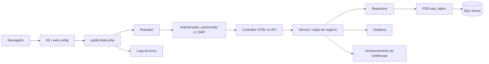

# Arquitetura proposta

## Decisão

Adotar uma aplicação PHP pura com um único diretório público, front controller, controllers finos, services transacionais e repositories exclusivos para SQL Server. O protótipo estático e o SQLite permanecem temporariamente apenas como fontes de comparação e dados de migração.

## Fluxo de requisição



## Estrutura-alvo

```text
app/
  auth/
  config/
  controllers/
    api/
    web/
  core/
  helpers/
  middleware/
  repositories/
  services/
  validators/
assets/
  css/
  img/
  js/
  vendor/
database/
  scripts/
docs/
public/
  assets/
  index.php
  web.config
storage/
  backups/
  logs/
  temporarios/
uploads/
  evidencias/
views/
  components/
  layouts/
  ...modulos/
```

Em produção, o site IIS deve apontar para `public/`. Configuração, código, logs, uploads privados e scripts de banco ficam fora da raiz pública.

## Responsabilidades

- Front controller e roteador: resolver rota, método e formato de resposta.
- Middleware: sessão, autenticação, perfil, escopo, CSRF e cabeçalhos.
- Controllers: entrada, autorização da ação, chamada do service e resposta.
- Services: transições, regras corporativas, transações e auditoria.
- Repositories: SQL Server parametrizado, paginação e mapeamento de dados.
- Validators: regras de campos e mensagens consistentes.
- Views: apresentação e escape, sem SQL ou regras de negócio.
- Core: PDO, request/response, sessão, erros, logs e upload.

## Estratégia para duplicações

1. Tornar `public/index.php` a única entrada da aplicação.
2. Remover a execução direta de `public/api/*.php`; as rotas `/api/*` serão resolvidas pelo roteador.
3. Manter uma única árvore de código em `app/controllers/api`.
4. Manter ativos-fonte em `assets/` durante a transição e publicar uma cópia controlada em `public/assets/`, preferencialmente por processo documentado.
5. Converter gradualmente os HTML da raiz em views PHP e, após equivalência, retirar os protótipos da execução.
6. Migrar cálculos e workflows do JavaScript para services antes de desativar a persistência local.

## Convenções

- Classes e arquivos em português consistente, `PascalCase` para classes e `camelCase` para métodos.
- Sem namespaces obrigatórios para reduzir complexidade no PHP 7.1, mas com carregador próprio simples e documentado.
- Datas do domínio tratadas como valores validados e convertidas no repository.
- JSON público com envelope consistente e códigos HTTP adequados.
- Nenhum DDL executado em requisições da aplicação.
- Nenhuma credencial versionada; configuração por variáveis do IIS ou arquivo externo protegido.

