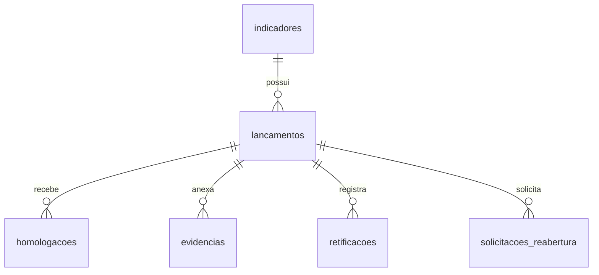

# Diagnóstico do banco de dados

## Status da fonte

Este documento descreve o esquema versionado em `database/sqlserver/schema.sql` e o relatório de migração gerado em 07/07/2026. Ele é provisório até que o esquema do banco corporativo `DB5319_IndicadoresEstrategicos`, no servidor `DF7436SR439`, seja extraído e comparado.

Não se deve considerar nenhuma coluna abaixo como autorizada apenas porque está no script local.

## Tabelas encontradas no script SQL Server

| Tabela | Chave | Relacionamentos explícitos | Observação |
|---|---|---|---|
| `indicadores` | `id` | origem de lançamentos | IDs em `NVARCHAR(100)` e datas em texto. |
| `lancamentos` | `id` | `indicador_id -> indicadores.id` | Unicidade por indicador e competência. |
| `homologacoes` | `id` | `lancamento_id -> lancamentos.id` | Guarda ações e transições. |
| `solicitacoes_reabertura` | `id` | `lancamento_id -> lancamentos.id` | Uma solicitação pendente por lançamento. |
| `retificacoes` | `id` | `lancamento_id -> lancamentos.id` | Versões anterior e nova em JSON textual. |
| `evidencias` | `id` | `lancamento_id -> lancamentos.id` | Metadados e caminho de arquivo. |
| `auditoria` | `id` | vínculo lógico por entidade/ID | Sem chave estrangeira. |
| `configuracoes` | `chave` | nenhum | Valor armazenado em `valor_json`. |
| `usuarios_validacao` | `id` | nenhum | Perfil, unidade, diretoria e permissões em JSON. |
| `backups_importacao` | `id` | nenhum | Registro de backups/importações. |
| `usuarios_acesso` | `id` | matrícula única | Script local adiciona campos além dos sete informados no prompt. |
| `acessos_log` | `id` | nenhum | Log de autenticação/acesso. |

## Relacionamentos provisórios

`auditoria`, `configuracoes`, `usuarios_validacao`, `usuarios_acesso`, `acessos_log` e `backups_importacao` não têm relacionamentos físicos declarados no script versionado.

## Resultado da migração registrada

- 23 indicadores, 276 lançamentos, 26 homologações, 26 evidências, 80 auditorias, 10 configurações, 13 usuários de validação e 1 backup foram reconciliados entre SQLite e SQL Server.
- Não foram encontrados órfãos nas cinco relações verificadas.
- `solicitacoes_reabertura` e `retificacoes` estavam vazias.
- `usuarios_acesso` e `acessos_log` existiam, mas estavam vazias.
- O status final foi `alertas`.
- Três valores de `configuracoes.valor_json` falharam no `ISJSON`: `ano_referencia`, `ultima_migracao_json_sql` e `versao_base`.

## Divergências e riscos

1. O prompt informa para `usuarios_acesso` apenas `id`, `matricula`, `nome`, `perfil`, `sg_unidade`, `no_unidade` e `ativo`. O script local também cria `email`, `unidade_apuradora`, `diretoria_responsavel`, `created_at` e `updated_at`. Esses campos extras precisam ser confirmados antes do uso.
2. O código executa criação automática de tabelas de autenticação durante uma requisição. Isso contraria a regra de não alterar estrutura sem validação e exige privilégios DDL desnecessários para a aplicação.
3. Datas de negócio estão majoritariamente em `NVARCHAR`, o que dificulta validação, ordenação e índices.
4. Resultados numéricos e percentuais estão em texto, aumentando risco de conversão e cálculo incorreto.
5. Alguns repositories usam `INSERT OR REPLACE`, exclusivo do SQLite, mesmo quando a conexão pode ser SQL Server.
6. `SolicitacoesReaberturaRepository` executa `CREATE TABLE IF NOT EXISTS`, também exclusivo do SQLite.
7. O banco padrão da configuração é `Estrategia`, divergente de `DB5319_IndicadoresEstrategicos`.

## Extração necessária no ambiente corporativo

Antes de implementar módulos, obter com acesso somente leitura:

- definição de colunas, tipos, nulabilidade, defaults e identidades;
- PKs, FKs, índices, constraints e triggers;
- amostra anonimizada dos valores de status e perfis;
- volume e distribuição por tabela;
- procedures ou jobs que alterem essas tabelas;
- collation e versão do SQL Server;
- permissões concedidas à identidade do Application Pool.

Após a extração, produzir comparação campo a campo com o script local e uma proposta formal para cada divergência. Nenhuma alteração estrutural foi autorizada nesta etapa.

