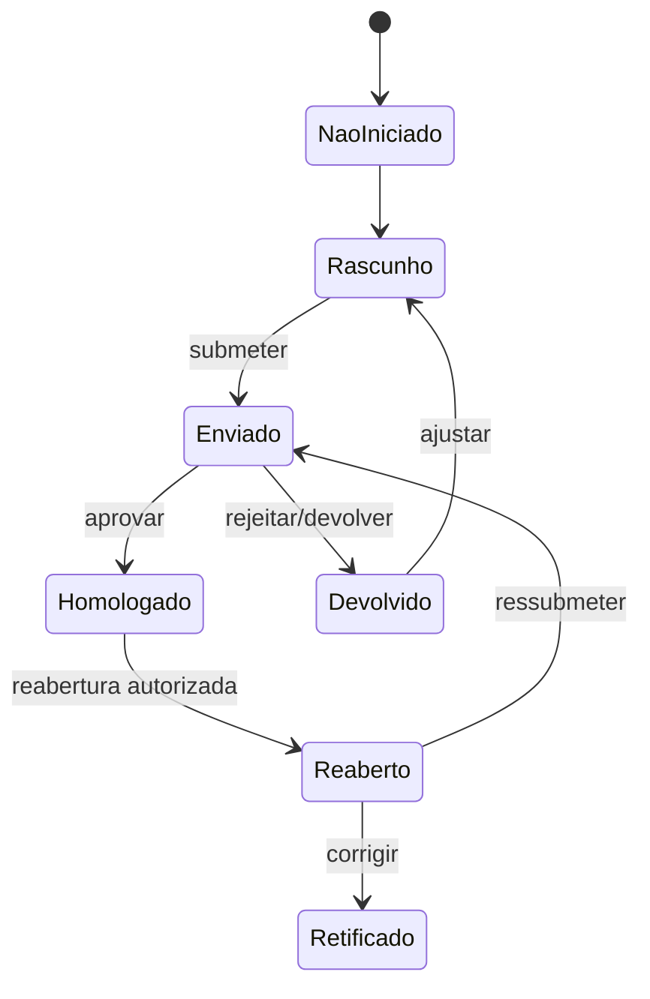

# Regras de negócio, estados e acesso

## Fonte e validade

As regras abaixo foram extraídas do prompt e confrontadas com o código atual. São uma especificação de trabalho; os pontos marcados como validação necessária dependem da área de negócio ou da confirmação da autenticação corporativa.

## Fluxo de lançamento observado

Estados encontrados no código: `Não iniciado`, `Rascunho`, `Em preenchimento`, `Enviado para homologação`, `Homologado`, `Devolvido para ajuste`, `Reaberto` e `Retificado`.

O prompt, por outro lado, define homologações como `Pendente`, `Aprovado` e `Rejeitado`. O modelo atual registra ações com o estado do lançamento, não uma fila independente com esses três estados. Essa diferença precisa ser resolvida com a área de negócio.

## Regras identificadas

- Unidade apuradora só pode manipular indicadores e lançamentos de sua unidade.
- Lançamento homologado não pode ser alterado pela unidade no fluxo comum.
- Homologador é filtrado pela diretoria responsável.
- Administrador tem escopo global.
- A submissão encaminha o lançamento para homologação.
- Aprovação transforma o lançamento em `Homologado`.
- Rejeição atual transforma o lançamento em `Devolvido para ajuste`.
- Reabertura de homologado é tratada por solicitação e decisão administrativa no endpoint atual.
- Toda mutação relevante deve gerar auditoria; hoje parte do histórico ainda chega como coleção enviada pelo frontend.
- O motor de cálculo PHP ainda não implementa a fórmula oficial; o service declara que o cálculo permanece no frontend.

## Matriz de acesso proposta

| Módulo/ação | Administrador | Homologador | Unidade apuradora | Usuário companhia |
|---|---:|---:|---:|---:|
| Resumo executivo / dashboard | Sim, global | Sim, escopo definido | Sim, sua unidade | Sim, dados liberados |
| Visão trimestral | Sim | Sim, escopo definido | Sim, sua unidade | Sim, dados liberados |
| Consultar indicadores | Sim | Sim | Sim, vinculados | Sim, liberados |
| Cadastrar/editar indicador | Sim | Não | Não | Não |
| Consultar lançamentos | Sim, global | Sim, sua diretoria | Sim, sua unidade | Conforme liberação |
| Criar/editar rascunho | Sim | Não | Sim, sua unidade | Não |
| Submeter lançamento | Sim | Não | Sim, sua unidade | Não |
| Homologar/rejeitar | Sim, se regra aprovada | Sim, sua diretoria | Não | Não |
| Solicitar reabertura/retificação | Sim | Conforme regra a confirmar | Sim, próprio escopo | Não |
| Decidir reabertura | Sim | Não, salvo regra aprovada | Não | Não |
| Relatórios | Sim | Sim, seu escopo | Sim, sua unidade | Dados liberados, a confirmar |
| Usuários/configurações | Sim | Não | Não | Não |
| Auditoria | Sim | Histórico próprio, a confirmar | Histórico próprio, a confirmar | Não |

## Divergências com a implementação atual

- `public/indicadores.php` permite acesso apenas a unidade, homologador e administrador; o prompt permite consulta ao usuário companhia conforme nível liberado.
- `public/relatorios.php` também exclui usuário companhia, embora o frontend liste esse perfil como permitido.
- `public/lancamentos.php` exclui homologador, enquanto o prompt permite ao homologador consultar lançamentos encaminhados.
- O endpoint genérico `api/database.php` aceita substituição integral de coleções, uma superfície ampla demais para regras de autorização por ação.
- O frontend contém rótulos extras como `Consulta/Gestão`, que não pertence aos quatro perfis oficiais.
- O código usa campos adicionais em `usuarios_acesso` para escopo; eles ainda não foram confirmados no banco real.

## Validações externas necessárias

- Confirmar se o arquivo corporativo `LDAP.php` é o mecanismo oficial e seu contrato de dados.
- Confirmar responsáveis e escopo exato de homologação.
- Aprovar estados canônicos e transições, incluindo diferença entre rejeição e devolução.
- Definir quem pode solicitar e decidir reabertura e retificação.
- Definir quais dados são “liberados” ao usuário companhia.
- Aprovar a matriz de acesso antes da implementação definitiva.

