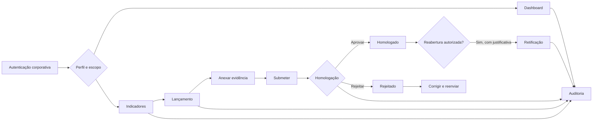

# Fluxos funcionais

```mermaid
flowchart LR
  A[Autenticação corporativa] --> B{Perfil e escopo}
  B --> C[Dashboard]
  B --> D[Indicadores]
  D --> E[Lançamento]
  E --> F[Anexar evidência]
  F --> G[Submeter]
  G --> H{Homologação}
  H -->|Aprovar| I[Homologado]
  H -->|Rejeitar| J[Rejeitado]
  J --> K[Corrigir e reenviar]
  I --> L{Reabertura autorizada?}
  L -->|Sim, com justificativa| M[Retificação]
  C --> N[Auditoria]
  D --> N
  E --> N
  H --> N
  M --> N
```

Toda transição valida CSRF, permissão, escopo, estado anterior e dados obrigatórios; decisões e justificativas devem ser auditadas.
